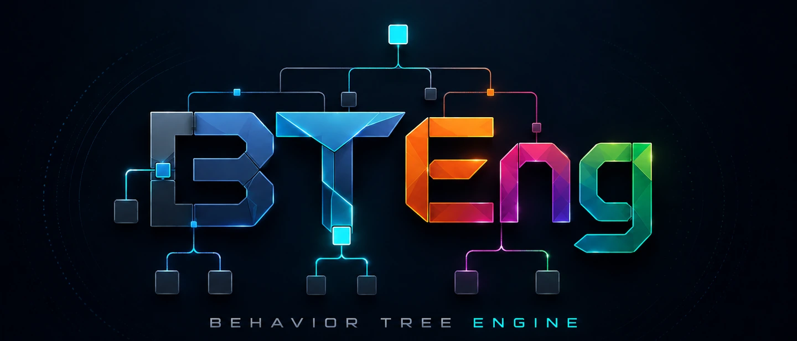

# BTEng

<p align="center">
  
</p>

**BTEng is a Behavior Tree engine for Python with no runtime dependencies.**

Every module the engine loads at runtime imports only the standard library, so
`pip install bteng` adds one package and nothing else to your environment. The two
modules that do import third-party code — the ZMQ transport and the pytest plugin — are
loaded only when you ask for them. It helps you model behavior as small decision trees
instead of one large control loop — for robotics, automation, simulation, and anything
tick-driven that needs preconditions, fallbacks, retries, recovery paths, or
long-running actions ticked over time.

What sets it apart, in one line each:

- **`async def` leaves, synchronous tick loop** — `CoroActionNode` awaits your host's
  coroutines without making your control loop async. See
  [Asyncio integration](advanced/asyncio-integration.md).
- **Reactive nodes that watch the blackboard** — guards re-checked every tick, running
  actions interrupted the moment a precondition fails. See
  [Reactive internals](advanced/reactive-internals.md).
- **Introspection from one instrumentation point** — inspector, logger, tracer and the
  optional ZMQ stream all fed by the same status transition. See
  [Introspection and logging](advanced/introspection-logging.md).

---

## Start here

New users: follow the start-here path in order. Each page builds on the previous.

1. [What is BTEng?](start-here/what-is-bteng.md)
2. [Core Concepts](start-here/concepts.md)
3. [Install](start-here/install.md)
4. [5-minute Quick Start](start-here/quickstart.md)
5. [Which API should I use?](start-here/which-api.md)

---

## Beginner — understand the fundamentals

| Topic | Page |
|-------|------|
| Control flow: Sequence, Fallback, Parallel | [Control nodes](beginner/control-nodes.md) |
| Leaf nodes: actions and conditions | [Actions and Conditions](beginner/actions-conditions.md) |
| Multi-tick actions with lifecycle methods | [Stateful Actions](beginner/stateful-action.md) |
| Shared state between nodes | [Blackboard basics](beginner/blackboard-basics.md) |
| Build trees with the fluent API | [TreeBuilder tutorial](beginner/treebuilder-tutorial.md) |
| Test a tree without hardware | [Testing your first tree](beginner/testing-first-tree.md) |

## Practical recipes — solve specific problems

| Problem | Recipe |
|---------|--------|
| Re-check a condition while an action runs | [Guard condition](recipes/guard-condition.md) |
| Retry flaky work, then fall back | [Retry with recovery](recipes/retry-recovery.md) |
| Span many ticks with a clean lifecycle | [Long-running action](recipes/long-running-action.md) |
| Run blocking I/O without stalling the tick loop | [Async action](recipes/async-action.md) |
| Reuse the same behavior with different inputs | [Subtree reuse](recipes/subtree-reuse.md) |
| Define nodes in Python, load from XML | [XML tree from Python nodes](recipes/xml-tree-from-python-nodes.md) |

## Advanced — go deeper when you need to

| Topic | Page |
|-------|------|
| Declare and validate node data contracts | [Ports and validation](advanced/ports-validation.md) |
| How reactive re-evaluation works internally | [Reactive execution internals](advanced/reactive-internals.md) |
| Subtree namespace isolation | [Blackboard scoping](advanced/blackboard-scoping.md) |
| Change the tree while it is running | [Runtime tree modification](advanced/runtime-modification.md) |
| Register and distribute node packages | [Plugins and NodeFactory](advanced/plugins-nodefactory.md) |
| Observe execution with Inspector and Logger | [Introspection and logging](advanced/introspection-logging.md) |
| Stream live execution data over ZMQ | [ZMQ streaming](advanced/zmq-streaming.md) |

## Reference — look up a class or method

| Area | Reference |
|------|-----------|
| Node types | [Node Types](reference/nodes.md) |
| TreeExecutor and BehaviorTreeEngine | [Executor & Engine](reference/executor.md) |
| TreeBuilder API | [TreeBuilder](reference/builder.md) |
| XML format | [XML Format](reference/xml.md) |
| Blackboard API | [Blackboard](reference/blackboard.md) |
| Inspector, Logger, Tracer | [Introspection](reference/introspection.md) |
| CancellationToken, ThreadPool | [Concurrency](reference/concurrency.md) |
| NodeFactory, plugins | [Factory & Plugins](reference/factory.md) |
| MockActionNode, BehaviorTreeTest | [Testing](reference/testing.md) |

---

## What BTEng provides

| Area | Capabilities |
|------|--------------|
| Tree construction | Fluent `TreeBuilder`, XML loading, subtree support |
| Execution | `TreeExecutor`, manual ticks, background event loop, pause/resume |
| Node library | Sequence, Fallback, Parallel, decorators, actions, conditions |
| State sharing | Thread-safe blackboard with child scopes, remapping, and history |
| Reactive behavior | `ReactiveSequenceNode` and `ReactiveFallbackNode` |
| Long-running work | `StatefulActionNode`, `AsyncActionNode`, cancellation token, thread pool |
| Observability | Inspector, logger, execution tracer, optional ZMQ stream |
| Testing | Mock nodes and `BehaviorTreeTest` |
| Extensibility | `NodeFactory`, `@register_node`, plugin loading |

---

## Runnable examples

Two complete programs live in [`examples/`](../examples/). Each defines its tree in XML
under [`examples/trees/`](../examples/trees/) and registers the node types in Python, so
the behaviour is data you can edit without touching code. Both simulate their machine
actions — random durations, occasional failures — so neither needs hardware:

```bash
python3 examples/01_creature_comfort.py
python3 examples/02_industrial_cell.py
```

| Example | Shows |
|---------|-------|
| [`01_creature_comfort.py`](../examples/01_creature_comfort.py) 🐹<br/>[`creature_comfort.xml`](../examples/trees/creature_comfort.xml) | The smallest useful tree: Sequence + Fallback, "act only if the need is unmet", and a `StatefulActionNode` that spans several ticks |
| [`02_industrial_cell.py`](../examples/02_industrial_cell.py) 🏭<br/>[`industrial_cell.xml`](../examples/trees/industrial_cell.xml) | A pick-and-place cell: `ReactiveSequence` guard that halts a running motion, `Retry` for a flaky gripper, `Timeout` on a traverse, and a recovery `Fallback` |

---

## Project

| Topic | Page |
|-------|------|
| Architecture and data flow | [Architecture](architecture.md) |
| Release history | [Changelog](changelog.md) |
| Licensing and dependency audit | [License documentation](license/README.md) |
