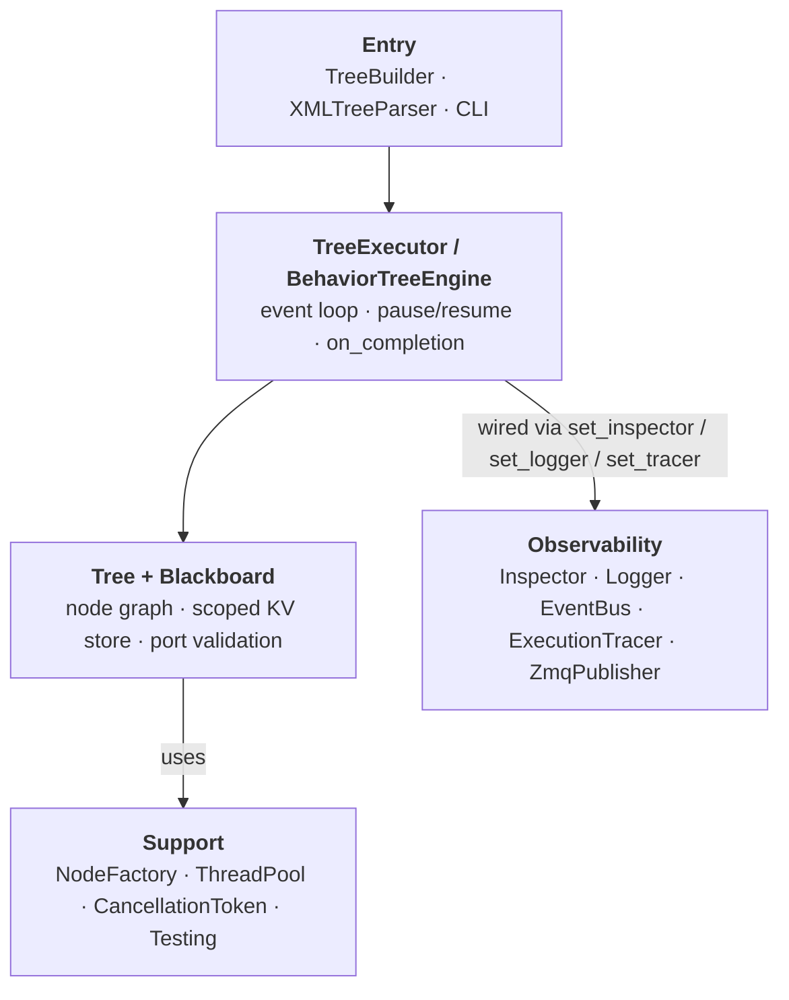
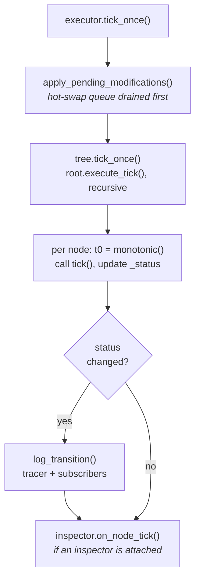
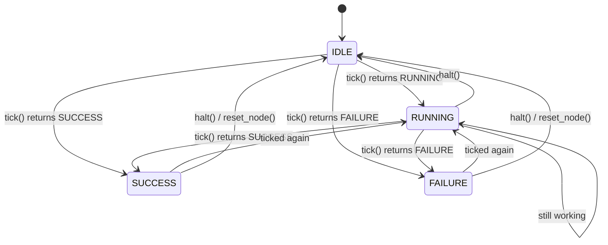
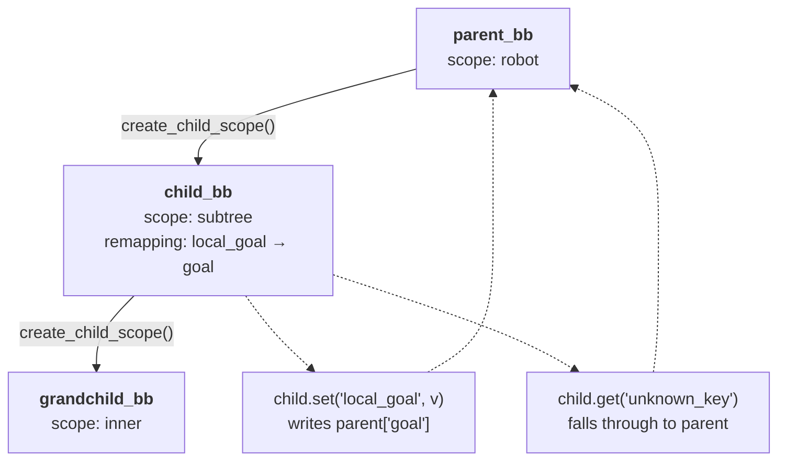
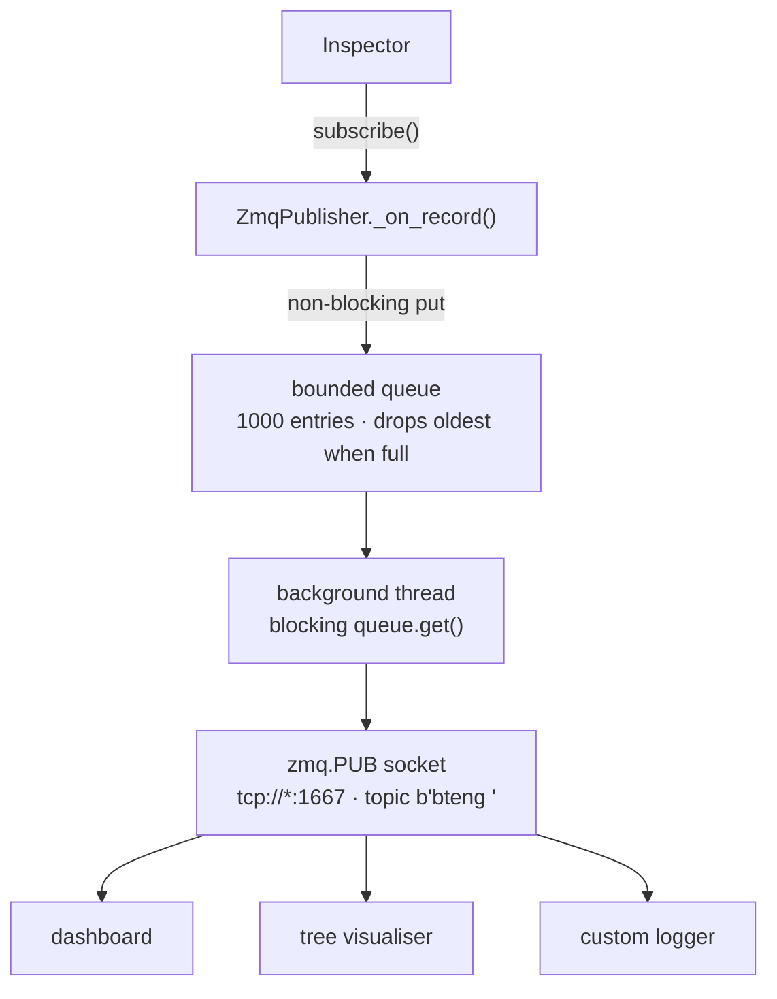
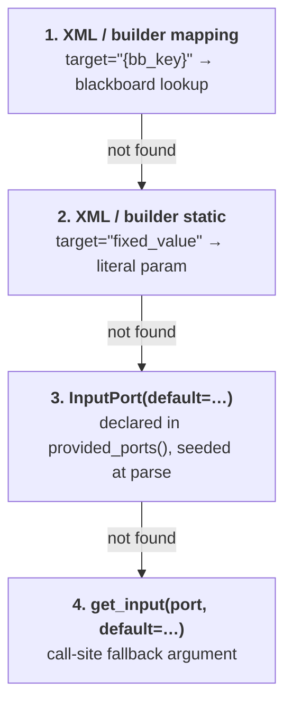

# BTEng Architecture

## Overview

BTEng is structured as a clean, layered engine where each concern lives in exactly one place.



---

## Module Map

| Package | Responsibility |
|---------|---------------|
| `bteng.core.node` | `TreeNode`, `NodeStatus`, `NodeConfig`, `NodeContract`, port types |
| `bteng.core.tree` | `Tree`, `TreeMetadata`, `TreeRegistry`, hot-swap, modification queue |
| `bteng.core.executor` | `TreeExecutor`, `ExecutorConfig`, `EventBus`, `BehaviorEvent` |
| `bteng.core.engine` | `BehaviorTreeEngine` (legacy — kept for backward compatibility) |
| `bteng.core.tree_builder` | `TreeBuilder` — fluent Python builder API |
| `bteng.blackboard` | `Blackboard` — scoped, observable, provenance history |
| `bteng.factory` | `NodeFactory` singleton, `@register_node`, `NodeManifest` |
| `bteng.nodes.control` | Sequence, Fallback, Parallel, Reactive variants |
| `bteng.nodes.decorators` | Inverter, Retry, Timeout, RateController, Force* |
| `bteng.nodes.leaf` | ActionNode, ConditionNode, StatefulActionNode, AsyncActionNode |
| `bteng.concurrency` | `ThreadPool` (auto-injected), `CancellationToken` |
| `bteng.introspection` | `Inspector`, `Logger`, `ZmqPublisher` |
| `bteng.logging` | `ExecutionTracer` — per-tick frame recorder (replay / regression) |
| `bteng.xml_parser` | XML → live tree (extensible, zero parser changes for new types) |
| `bteng.plugins` | Dynamic plugin file / module loading |
| `bteng.testing` | `MockActionNode`, `MockConditionNode`, `BehaviorTreeTest` |

---

## Execution Model

### Tick chain

Each call to `tick_once()` follows this path through the stack:



**Key invariant:** `self._status` inside `tick()` always reflects the *previous* tick's
result. This is by design — `StatefulActionNode`, `Retry`, `Timeout`, and `RateController`
all use `self._status != RUNNING` to detect first-entry without extra flags.

### Inspector ↔ Logger wiring

When both `set_inspector()` and `set_logger()` are called on an executor (in any order),
the logger is automatically subscribed to the inspector. Every `NodeExecutionRecord`
emitted by the inspector triggers a `Logger.log_transition()` call. No manual
subscription code is needed.

```python
executor.set_inspector(inspector)
executor.set_logger(logger)    # auto-wired; order doesn't matter
```

### ThreadPool auto-injection

`TreeExecutor` traverses the full node graph when `set_tree()` or `set_thread_pool()`
is called and injects the shared `ThreadPool` into every `AsyncActionNode` it finds.
Manual `node.set_thread_pool(pool)` calls are no longer required.

---

## Tick Lifecycle



Two rules this diagram encodes, both enforced in `execute_tick()`:

- **A node need never pass through `RUNNING`.** A condition that answers on its first
  tick goes straight from `IDLE` to `SUCCESS` or `FAILURE`. This is the common case.
- **`IDLE` is a resting state, not a tick result.** `execute_tick()` raises `TypeError`
  if `tick()` returns `IDLE` or `None`, because every control node misreads those
  exactly like a non-answer: a `Sequence` advances past the node, a `Fallback`
  advances, a `Parallel` never completes.

A finished node that is ticked again simply takes its new result — no reset required.
`SUCCESS` and `FAILURE` are resting states, not terminal ones.

`halt()` is called by:

- Parent control node when a sibling fails or succeeds (frees RUNNING children)
- `TreeExecutor` when `halt_tree()` is called or the tree completes with `halt_on_completion=True`
- External code via `tree.halt_all()`

`_on_halt()` is the internal cleanup hook. For `TreeNode` it is only called when
`_status == RUNNING`. `ControlNode.halt()` and `DecoratorNode.halt()` propagate halts
to their children directly.

---

## Concurrency

| Mechanism | Use case |
|-----------|----------|
| `AsyncActionNode` + `ThreadPool` | Non-blocking leaf nodes; pool auto-injected by executor |
| `CancellationToken` | Cooperative cancellation of async tasks |
| `ParallelNode` | Conceptual parallelism — ticks all children in the same thread |
| `Blackboard` (`threading.RLock`) | Safe cross-thread data sharing |
| `Inspector` (`threading.Lock`) | Thread-safe event collection |
| `ZmqPublisher` background thread | Decoupled event streaming; never blocks the tick loop |

---

## Blackboard Scoping

Child scopes fall through to their parent for unknown keys. Subtrees get their own scope
so internal keys don't pollute the parent namespace.



- Writes to a remapped key in a child scope are forwarded to the parent's key.
- Reads fall through from child → parent if the key is not found locally.
- `None` is a valid stored value — `bb.has(key)` returns `True` and `bb.get(key)`
  returns `None`, not the default.

```python
parent = Blackboard.create("robot")
child  = parent.create_child_scope("subtree", remapping={"local_goal": "goal"})

child.set("local_goal", (1.0, 2.0))   # writes parent["goal"]
child.get("local_goal")               # reads parent["goal"]
child.get("other_key")                # falls through to parent["other_key"]
```

---

## Runtime Tree Modification

Structural changes (replace / insert / remove nodes) are queued and applied atomically
between ticks — a running node is never interrupted mid-tick.

```python
from bteng import TreeModification, ModificationType

tree.queue_modification(TreeModification(
    type=ModificationType.REPLACE_NODE,
    target_uid=old_node.uid,
    new_node=new_node,
))
# Applied at start of next executor tick
```

`Tree.hot_swap_subtree()` applies immediately and should only be called from the
executor thread (or while the executor is stopped).

---

## ZMQ Event Stream

`ZmqPublisher` connects the Inspector to the outside world with zero coupling to any
specific GUI or monitoring stack.



The tick loop never blocks on this path: `_on_record()` drops the oldest entry when the
queue is full, and the socket send uses `zmq.NOBLOCK` and swallows `zmq.Again`.

If the queue fills (1 000 entries), the oldest record is dropped. Real-time display;
no backpressure.

---

## Port Default Resolution Order

For any input port, value resolution follows this priority:



The XML parser seeds `params` from the `InputPort` manifest defaults before processing
XML attributes, so XML values always override but defaults apply when the attribute is
absent.
